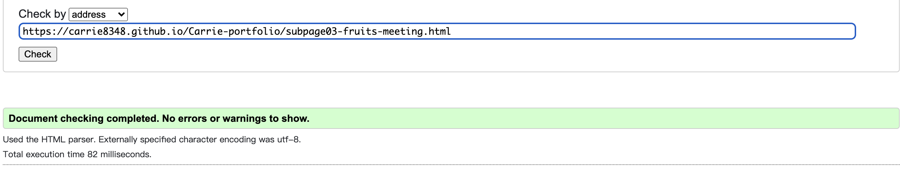
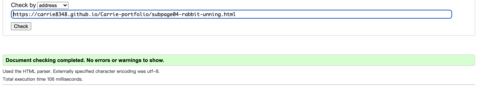

**Carrie Qian Stop-Motion Content Maker - Portfolio**

**About**

This is a website showcases Carrie Qian's stop motion projects. It is created for my MS1 project with Code Institute. It is a basic portfolio.

I hope that while letting the user see my projects, it can also stimulate everyone's creative needs and desires, so that everyone takes a moment to observe days and things surrounding us,  to use the common things we see in everyday life,  to create a new magic world for ourselves. To get rid of the concept that creation is only for professionals, enjoy the fun of creating content. 

The skills of making these videos are something easy to grasp. But to grasp the creative thinking through making the videos, through lots of practice on them, are the most important thing. This is another message I want to share with users. 

Mainly for the people looking for someone to work within this field, I hope this website can work as a proper portfolio to show my capabilities.

**User Stories:**
- Michelle
	Michelle works in a teaching material company. Currently organizing a project of teaching kids to study stop motion skills. She needs someone who can show the tricks, how it works, the split scenes, and explain it. To inspire students so that they can be more creative. To also show the color combinations, artsy vibe to the students.
	- She needs the person to also have the ability to make the video, make the tutorial ppt, make the materials, and edit the video, inc. sound design, motion graphics, etc.
- Allen
	- Allen is having a YouTube channel. He needs a partner that can present ideas, can design the storyboard together, add more spicy elements like stop-motion in it, and film together.
- Eric
	- Eric is interested in stop motion but doesn't know where to start. He has checked channels like YouTube or Pinterest. He needs more detailed instruction and tips. 
- Jenny
	- Jenny is working as an advertising agent, and looking for people who can make product videos in creative ways. She finds stop motion is a good trick to use in the videos. She needs someone who can make a video, edit the video, and show a clear message to the audience. 

**Conclusion:**
- A user looking for more detailed instruction on stop motion.
- A user looking for a partner to work on stop-motion videos together.
- A user looking for a person to hire for stop-motion teaching materials.
- A user looking for a video content maker to impress the clients. 
---
**Reasons for the Website**
- Show my ability on making stop-motion videos;
- Show my ability to sort out the material and creative thinking;
- Showcase to get more opportunities for stop motion projects and work.
---
**What a user may expect**
- Easy to navigate the website;
- Video examples;
- Responsive in all devices;
- Links and functions work as expected;
- Contact details are presented;

**What a user may want**
- To find a content maker and reach out to her/him.
- To see stop motion videos using different objects, materials, for brainstorming;

**As a developer I expect**
- To have the opportunity to work on more projects with companies;
- To showcase the projects and show my value as a content maker;
---
**Structure**
The website will consist of  10 HTML pages (4 category pages, and 6 sub-pages linked to the projects page)
- A home page
- A project page
- A about-me page
- A contact page with a form
---
**Surface**
Mild background with black font, and hover red.

---
**Skeleton**
Wireframes:

---
**Scope**
For employers or potential partners, I'd love to provide them with what I have done, in the About page, I talked about my experiences related to this field. I also introduce a little bit about myself, just for people to get to know me a bit better.

---
**Features**
- Logo and Navigation Bar
- Responsiveness
- Footer
- Meta data
- Redirect

---
**Features specific to pages**

**Homepage**
- My hand-drawn self-portrait illustration;

**Project page**
- Thumbnail picture gallery link to several subpages of actual project videos;

**About page**
- My photo and text;

**Subpage:**
- Youtube video link to the page;
- A button to go back to the previous page;

**Contact page:**
- A form;

---
**Technologies Used **
- HTML5: Mark-up language using semantic structure.
- CSS3： Cascading style sheet used to style.
- Gitpod.io: For writing the code. Using the command line for committing and pushing to Git Hub.
- GitHub: Used to host repository.
- GIT： for version control of the project.

**Design:**
- Google fonts: For styling the typography.
- Font Awesome: For social media icons.

**Testing:**
- HTML Validator: Testing validity of HTML.
- CSS Validator: Testing validity of CSS.
---
**Testing**
HTML Validator Results:

CSS Validator Results:

---
Deployment

---
Content

